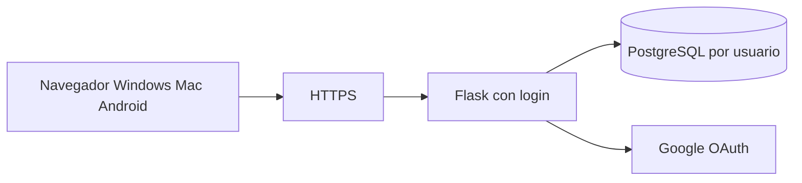

# Entregable — Sesión del 29 de julio de 2026

**Estudiante:** Ricardo Díaz  
**Curso:** Cenfotec Curso 2  
**Proyecto:** Gestión financiera personal (Flask + Tkinter)  
**Herramienta:** Cursor (asistente de código con IA)

---

## Introducción

En esta sesión se trabajó sobre la aplicación de **gestión financiera personal**, que permite registrar ingresos, gastos fijos, gastos imprevistos y metas de ahorro; calcular balance, ahorro y progreso; y visualizar un resumen con gráficos.

El trabajo siguió los **cuatro ejercicios** del laboratorio: refinamiento de prompt, lectura de código, depuración asistida y extensión del programa.

---

## Ejercicio 1 — Refina un prompt vago

### Prompt vago (original)

> migra la aplicacion a web compatible

**Problema del prompt:** no indica tecnología web, qué funcionalidades conservar, si debe reutilizar la lógica existente, ni cómo debe verse la interfaz.

### Prompt refinado (versión mejorada)

> Migra la aplicación de gestión financiera personal de Tkinter (`main.py`) a una **versión web** en Python usando **Flask**, reutilizando `models.py` y `validators.py`. La interfaz debe tener **pestañas** equivalentes a la versión de escritorio: Ingresos, Gastos fijos, Gastos imprevistos, Metas de ahorro, Resumen y Gráficos. Usa **Bootstrap 5** para diseño responsive y **Chart.js** para gráficos. Mantén la validación de entradas, el campo personalizado para «Otro imprevisto» y los mismos cálculos financieros. Organiza plantillas en `templates/` y archivos estáticos en `static/`.

### Qué elementos se agregaron al refinar

| Elemento | Por qué importa |
|----------|-----------------|
| Stack concreto (Flask, Bootstrap, Chart.js) | Evita ambigüedad sobre la tecnología |
| Reutilizar `models.py` y `validators.py` | No duplicar la lógica de negocio |
| Listado de pestañas | Garantiza paridad con la app de escritorio |
| Responsive + gráficos | Define experiencia de usuario en navegador |
| Estructura de carpetas | Facilita mantenimiento y despliegue |

### Resultado de aplicar el prompt refinado

Se generó la versión web con estos archivos nuevos o modificados:

| Archivo / carpeta | Función |
|-------------------|---------|
| [`app.py`](app.py) | Servidor Flask, rutas y formularios |
| [`serialization.py`](serialization.py) | Guardar/cargar perfil en sesión del navegador |
| [`web_logic.py`](web_logic.py) | Resumen, advertencias y datos para gráficos |
| [`utils.py`](utils.py) | Formato de moneda (₡) compartido |
| [`templates/base.html`](templates/base.html) | Plantilla base HTML |
| [`templates/index.html`](templates/index.html) | Interfaz con 6 pestañas |
| [`static/css/app.css`](static/css/app.css) | Estilos adicionales |
| [`static/js/app.js`](static/js/app.js) | Gráficos Chart.js y «Otro imprevisto» |

La versión Tkinter ([`main.py`](main.py)) se mantiene como alternativa de escritorio.

---

## Ejercicio 2 — Lee e interpreta el código

En esta sesión se realizaron **dos actividades de lectura** documentadas en el chat.

### 2.1 Explicación de los archivos Python del proyecto

| Archivo | Qué hace |
|---------|----------|
| **`models.py`** | Define las clases de datos (`FixedExpense`, `UnexpectedExpense`, `SavingsGoal`, `FinancialProfile`) y **todos los cálculos**: ingresos, gastos, balance, ahorro, progreso de metas. |
| **`validators.py`** | Valida entradas del usuario (`parse_positive_amount`, `parse_required_text`) antes de guardar. |
| **`utils.py`** | Constantes (`CURRENCY`, `OTHER_UNEXPECTED_LABEL`) y función `format_money()`. |
| **`app.py`** | Conecta el **navegador** con la lógica: rutas HTTP, formularios, mensajes flash, sesión. |
| **`serialization.py`** | Convierte `FinancialProfile` ↔ diccionario JSON para la sesión web. |
| **`web_logic.py`** | Prepara tarjetas de resumen, advertencias y datos para Chart.js. |
| **`main.py`** | Misma lógica financiera, interfaz **Tkinter** (escritorio). |

**Relación entre capas:**

```text
models.py + validators.py + utils.py   ← lógica compartida
         ↓                    ↓
      main.py (Tkinter)    app.py (Flask) → templates/ + static/
```

### 2.2 Lectura de `app.py` con comentarios del estudiante

Se pegó el código de [`app.py`](app.py) con comentarios `#` del estudiante. La IA revisó cada duda. Resumen:

#### Comentario: `# no se que hacen estos import` (`os`, `secrets`)

| Import | Función |
|--------|---------|
| `os` | Accede al entorno del sistema; lee `FLASK_SECRET_KEY` si está configurada. |
| `secrets` | Genera una clave aleatoria segura si no hay clave en el entorno. |

#### Comentario: `# no se que hacen estos from`

| Import | Función |
|--------|---------|
| `Flask` | Crea la aplicación web. |
| `flash` | Muestra mensajes al usuario (éxito, error). |
| `redirect` | Redirige tras enviar un formulario. |
| `render_template` | Genera HTML desde `templates/`. |
| `request` | Datos del navegador (formularios, URL). |
| `session` | Almacena el perfil financiero entre peticiones. |
| `url_for` | Construye URLs por nombre de ruta. |
| `models`, `serialization`, `validators`, `web_logic` | Módulos propios del proyecto. |

#### Comentario: `# no se que hacen estos app = y app.secret`

- **`app = Flask(__name__)`** → crea la aplicación Flask.
- **`app.secret_key`** → clave para **cifrar la sesión** (no es `app.secret`). Sin ella Flask no puede guardar datos del usuario de forma segura.

#### Comentario: funciones reutilizables (`_load_profile`, `_save_profile`, `_redirect_tab`)

**Correcto:** son helpers internos (el `_` indica uso privado del módulo).

| Función | Acción |
|---------|--------|
| `_load_profile()` | Lee perfil de `session`; si no existe, crea uno vacío. |
| `_save_profile(profile)` | Guarda perfil en `session`. |
| `_redirect_tab(tab)` | Redirige a `/` con pestaña activa (`?tab=income`, etc.). |

#### Comentario: `# No se que hacen estos @app.`

Los decoradores **enlazan una URL con una función**:

| Decorador | Cuándo se ejecuta |
|-----------|-------------------|
| `@app.route("/")` | Usuario abre la página principal (GET). |
| `@app.post("/income")` | Usuario envía formulario de ingresos (POST). |
| `@app.post("/expenses/add")` | Agrega gasto fijo. |
| … | Mismo patrón para imprevistos, metas, eliminar, reiniciar. |

**Patrón repetido en cada POST:** cargar perfil → validar → si error `flash` + redirigir → si OK modificar → guardar → mensaje éxito → redirigir.

#### Comentario: `# Imagino que aqui se refiere a como se va accesar la aplicacion`

**Correcto.** Al ejecutar `python app.py`:

```python
if __name__ == "__main__":
    app.run(debug=True, host="0.0.0.0", port=5000)
```

- Arranca el servidor en **http://127.0.0.1:5000**
- `host="0.0.0.0"` permite acceso desde otros dispositivos en la red local
- `debug=True` es solo para desarrollo (no usar en producción pública)

#### Conclusión del Ejercicio 2

`app.py` **no calcula** ingresos ni balance directamente: delega en `validators.py` (validar), `models.py` (calcular) y `web_logic.py` (presentar). Su rol es **conectar el navegador con la lógica de negocio**.

---

## Ejercicio 3 — Depuración asistida por IA

### Problema observado

Al ingresar texto aleatorio en **Salario mensual**, por ejemplo:

```text
sadfsfdasf
```

La aplicación muestra:

```text
Salario: Ingrese un número válido (ej.: 1500.50).
```

### Preguntas de depuración

1. ¿A qué se debe este mensaje?  
2. ¿Qué parte del código valida?  
3. ¿Es el comportamiento esperado?

### Análisis asistido por IA

#### Flujo del error

```text
Usuario escribe "sadfsfdasf" → Clic "Guardar ingresos"
        ↓
POST /income  →  save_income()  en app.py
        ↓
parse_positive_amount("sadfsfdasf", allow_zero=False)  en validators.py
        ↓
float("sadfsfdasf")  →  ValueError
        ↓
return None, "Ingrese un número válido (ej.: 1500.50)."
        ↓
flash("Salario: ...", "danger")  →  NO se llama _save_profile()
```

#### Código involucrado

**`app.py` — líneas 39-45:**

```python
@app.post("/income")
def save_income():
    profile = _load_profile()
    salary, err = parse_positive_amount(request.form.get("salary", ""), allow_zero=False)
    if err:
        flash(f"Salario: {err}", "danger")
        return _redirect_tab("income")
```

**`validators.py` — líneas 15-18:**

```python
try:
    amount = float(text)
except ValueError:
    return None, "Ingrese un número válido (ej.: 1500.50)."
```

### Conclusión de depuración

| Pregunta | Respuesta |
|----------|-----------|
| ¿Es un bug? | **No.** |
| ¿Es validación intencional? | **Sí.** |
| ¿Se corrompen los datos? | **No.** No se guarda nada inválido. |
| ¿Qué acepta el salario? | Números positivos: `500000`, `1500.50`, `1500,50` |
| ¿Qué rechaza? | Texto, negativos, vacío o cero (`allow_zero=False`) |

**Aprendizaje:** la depuración confirmó que la validación en `validators.py` protege los cálculos en `models.py`. No fue necesario cambiar código; fue necesario **interpretar** el mensaje.

### Otras pruebas de validación recomendadas

| Entrada | Resultado esperado |
|---------|-------------------|
| Salario `800000` | Guardado exitoso |
| Salario vacío | Error: campo obligatorio |
| Salario `-1000` | Error: no puede ser negativo |
| Ingresos extra `abc` | Error en ingresos adicionales |
| Monto gasto `xyz` | Error al agregar gasto |

---

## Ejercicio 4 — Extiende el programa

En esta sesión la extensión tuvo **dos niveles**:

### 4.1 Extensión ya implementada: migración a web

Resultado del Ejercicio 1 (prompt refinado). La app pasó de solo Tkinter a **web + escritorio**:

- 6 pestañas en navegador
- Mismos cálculos que `models.py`
- Gráficos con Chart.js (pastel y barras)
- Diseño responsive (Bootstrap 5)
- Compatible con Chrome, Edge, Firefox, Safari en Windows, Mac y Android

**Ejecutar versión web:**

```powershell
cd "c:\Users\RicardoDiaz\Documents\Cenfotec Curso 2"
python -m pip install -r requirements.txt
python app.py
```

URL: **http://127.0.0.1:5000**

### 4.2 Extensión planificada: migración a la nube, usuarios y seguridad

Se elaboró un **plan para la siguiente fase** (proyecto educacional, primera implementación pública):

#### Objetivos

- Publicar la app en internet (hosting gratuito / MVP)
- Cuentas de usuario con **«Continuar con Google»**
- Cumplir buenas prácticas **OWASP**
- Mantener interfaz intuitiva y compatible multi-dispositivo

#### Decisiones del estudiante

| Pregunta | Respuesta elegida |
|----------|-------------------|
| Perfil de hosting | **Gratuito / bajo costo** (Render, Railway, Fly.io) |
| Implementación de cuentas | **Sin preferencia** — se recomienda Flask + PostgreSQL + Authlib (aprendizaje equilibrado) |

#### Arquitectura objetivo



#### Hosting recomendado (MVP)

| Plataforma | Ventaja | Limitación free tier |
|------------|---------|----------------------|
| **Render** (recomendado) | HTTPS automático, Postgres incluido | App duerme tras inactividad |
| Railway | Fácil despliegue | Créditos mensuales limitados |
| Fly.io | Contenedores flexibles | Requiere Docker |

#### Autenticación propuesta

- **Google OAuth 2.0** con Authlib + Flask-Login
- Registro en Google Cloud Console
- Botón «Continuar con Google» en pantalla de login
- Cada usuario ve **solo su perfil financiero**

#### Seguridad OWASP (Top 10) — acciones planeadas

| Riesgo | Medida |
|--------|--------|
| Control de acceso roto | `@login_required`; consultas filtradas por `user_id` |
| Fallos criptográficos | HTTPS; cookies `Secure`, `HttpOnly`, `SameSite` |
| Inyección | SQLAlchemy ORM; mantener `validators.py` |
| Diseño inseguro | CSRF con Flask-WTF; rate limit en login |
| Configuración insegura | `debug=False` en producción; headers con flask-talisman |
| Componentes vulnerables | `pip-audit` / Dependabot |
| Fallos de autenticación | OAuth con state; logout; expiración de sesión |

#### Orden de implementación futuro

1. Refactor a *application factory* + `config.py`
2. PostgreSQL + modelos `User` / `FinancialProfile`
3. Reemplazar sesión anónima por BD por usuario
4. Google OAuth + Flask-Login
5. CSRF, Talisman, Limiter
6. Ajustes responsive finales
7. Despliegue en Render
8. Pruebas cross-browser

*(Este plan no se implementó en código hoy; queda documentado como hoja de ruta.)*

---

## Funcionalidad — Cálculos y widgets (Rúbrica 3)

> Nota: la rúbrica menciona total, descuento e IVA como ejemplo genérico. **Este proyecto calcula finanzas personales** (ingresos, gastos, balance, ahorro, progreso de metas).

### Casos de prueba — cálculos correctos

#### Caso 1 — Solo ingresos y gastos fijos

| Entrada | Valor |
|---------|-------|
| Salario | 500 000 |
| Gasto fijo: Alquiler | 200 000 |

| Resultado | Cálculo |
|-----------|---------|
| Ingresos totales | 500 000 |
| Gastos totales | 200 000 |
| Balance | **300 000** |

#### Caso 2 — Escenario completo (sesión de hoy)

| Entrada | Valor |
|---------|-------|
| Salario | 800 000 |
| Ingresos adicionales | 50 000 |
| Gastos fijos | 295 000 (250 000 + 45 000) |
| Imprevistos | 155 000 (35 000 + 120 000) |
| Ahorro planificado | 80 000 |
| Meta: ahorrado / objetivo | 200 000 / 1 000 000 |

| Resultado | Cálculo | Valor |
|-----------|---------|-------|
| Ingresos totales | 800 000 + 50 000 | **850 000** |
| Gastos totales | 295 000 + 155 000 | **450 000** |
| Balance | 850 000 − 450 000 | **400 000** |
| Ahorro efectivo | min(80 000, 400 000) | **80 000** |
| Dinero libre | 400 000 − 80 000 | **320 000** |
| Progreso meta | 200 000 / 1 000 000 × 100 | **20 %** |

#### Caso 3 — Validación (no guarda datos inválidos)

| Entrada salario | Resultado |
|-----------------|-----------|
| `sadfsfdasf` | Error; balance **no cambia** |
| `800000` | Guardado correcto |

### Widgets claros en la versión web

| Pestaña | Widgets |
|---------|---------|
| **Ingresos** | Formulario + vista previa de totales |
| **Gastos fijos** | Formulario, datalist de conceptos, tabla, total |
| **Gastos imprevistos** | Select de categoría, campo condicional «Otro imprevisto», tabla |
| **Metas de ahorro** | Formulario, tabla, **barras de progreso** |
| **Resumen** | **6 tarjetas** (ingresos, gastos, balance, ahorro, libre, metas), alertas de advertencia, tablas detalle |
| **Gráficos** | **Chart.js**: pastel (distribución) y barras (comparación) |

Mensajes **flash** (verde/rojo/amarillo) informan éxito o error tras cada acción.

---

## Autoevaluación según rúbrica

| Criterio | Descripción | Evidencia en este documento |
|----------|-------------|----------------------------|
| **1. Comprensión del enunciado** | Explicaciones y refinamientos muestran comprensión clara del código y del problema | Ejercicios 1 y 2: prompt refinado, rol de cada archivo, lectura corregida de `app.py`, fórmulas financieras |
| **2. Aplicación del proceso requerido** | Cuatro pasos: refinamiento, lectura, depuración, extensión | Ejercicios 1, 2, 3 y 4 documentados en orden |
| **3. Funcionalidad** | Cálculos correctos y widgets claros | Casos de prueba numéricos; descripción de pestañas, tablas, barras, tarjetas y gráficos; prueba de validación |

---

## Archivos del proyecto

```text
Cenfotec Curso 2/
├── app.py                    # Web Flask (entrada: python app.py)
├── main.py                   # Escritorio Tkinter
├── models.py                 # Cálculos financieros
├── validators.py             # Validación
├── utils.py                  # Formato moneda
├── serialization.py          # Sesión web
├── web_logic.py              # Resumen y gráficos
├── requirements.txt
├── templates/
│   ├── base.html
│   └── index.html
├── static/
│   ├── css/app.css
│   └── js/app.js
├── entregable_gestion_financiera.md    # Entregable inicial del proyecto
└── entregable_sesion_2026-07-29.md     # Este documento
```

---

## Entrega en el LMS

1. Subir **`entregable_sesion_2026-07-29.md`**
2. Adjuntar capturas opcionales:
   - App web en pestaña **Resumen** con datos del Caso 2
   - Mensaje de error al ingresar `sadfsfdasf` en salario
   - Pestaña **Gráficos** con datos cargados

---

**Fin del entregable — Sesión del 29 de julio de 2026**
